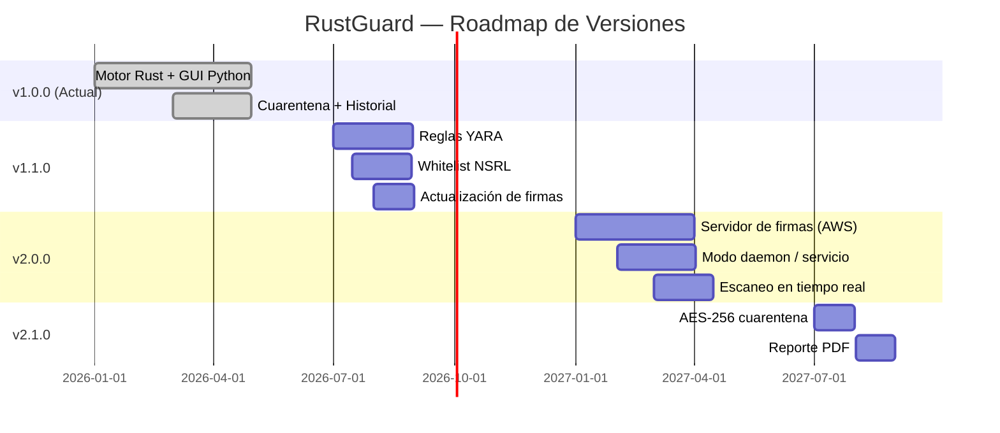

<center>


**UNIVERSIDAD PRIVADA DE TACNA**

**FACULTAD DE INGENIERIA**

**Escuela Profesional de Ingeniería de Sistemas**

**Proyecto RustGuard — Documento de Visión y Alcance**

Curso: *Calidad y Pruebas de Software*

Docente: *Mag. Patrick Cuadros Quiroga*

Integrantes:

***LLica Mamani, Jimmy Mijair (2023076789)***

***Sierra Ruiz, Iker Alberto (2023077090)***

**Tacna – Perú**

***2026***

</center>

<div style="page-break-after: always; visibility: hidden"></div>

Sistema *RustGuard Antivirus*

Documento de Visión y Alcance — FD02

Versión *1.0*

| CONTROL DE VERSIONES | | | | | |
|:---:|:---|:---|:---|:---|:---|
| Versión | Hecha por | Revisada por | Aprobada por | Fecha | Motivo |
| 1.0 | LLica Mamani, Jimmy Mijair | Sierra Ruiz, Iker Alberto | LLica Mamani, Jimmy Mijair | 28/03/2026 | Versión Original |

<div style="page-break-after: always; visibility: hidden"></div>

# ÍNDICE GENERAL

- [1. Descripción del Producto](#1-descripción-del-producto)
- [2. Características Principales](#2-características-principales)
- [3. Roadmap del Proyecto](#3-roadmap-del-proyecto)
- [4. GitHub Wiki](#4-github-wiki)

<div style="page-break-after: always; visibility: hidden"></div>

---

## 1. Descripción del Producto

### 1.1. Nombre

**RustGuard** — Motor de Antivirus de Alto Rendimiento

### 1.2. Visión General

RustGuard es una aplicación antivirus de escritorio multiplataforma (Windows, Linux, macOS) que combina un **motor de escaneo de alto rendimiento escrito en Rust** con una **interfaz gráfica moderna desarrollada en Python**. La comunicación entre ambas capas se realiza mediante **PyO3**, un puente FFI (Foreign Function Interface) que expone las funciones Rust como módulo Python nativo.

La arquitectura del sistema sigue los principios de **Clean Architecture** (Arquitectura Limpia) con separación estricta de capas: Dominio, Aplicación, Infraestructura y Presentación. Esto garantiza alta cohesión, bajo acoplamiento y facilidad de mantenimiento y prueba.

### 1.3. Propósito y Alcance

El propósito principal de RustGuard es proporcionar una herramienta de detección de malware eficiente y de código abierto que:

- Detecte amenazas mediante comparación de **hashes criptográficos** (SHA-256 y MD5) contra una base de datos SQLite de firmas conocidas.
- Aplique **análisis heurístico multi-capa** para detectar amenazas desconocidas basándose en patrones de comportamiento sospechoso.
- Gestione archivos maliciosos mediante un sistema de **cuarentena con ofuscación XOR**.
- Mantenga un **historial persistente** de sesiones de escaneo en formato JSON.
- Proporcione una **interfaz gráfica intuitiva** con tema oscuro, construida con CustomTkinter.

### 1.4. Usuarios Objetivo

| Tipo de Usuario | Descripción | Nivel Técnico |
|:----------------|:------------|:-------------:|
| Usuario doméstico | Persona que desea proteger su equipo personal | Básico |
| Administrador de sistemas | Profesional que gestiona equipos corporativos | Avanzado |
| Investigador de seguridad | Analista que estudia muestras de malware | Experto |
| Desarrollador | Colaborador que desea contribuir o extender el sistema | Avanzado |

### 1.5. Tecnologías Utilizadas

| Componente | Tecnología | Versión | Rol |
|:-----------|:-----------|:-------:|:----|
| Motor de escaneo | Rust | 1.75+ | Hashing, heurísticas, traversal de directorios |
| Interfaz FFI | PyO3 | 0.21 | Puente Python ↔ Rust |
| Build del motor | maturin | 1.5+ | Compilación y empaquetado como módulo Python |
| GUI | Python + CustomTkinter | 3.10+ / 5.2+ | Interfaz gráfica de escritorio |
| Base de datos de firmas | SQLite (rusqlite) | 0.31 | Almacenamiento persistente de hashes de malware |
| Empaquetado | PyInstaller | 6.x | Generación de ejecutable standalone |
| Hashing | sha2 + md5 (Rust crates) | 0.10 | Cálculo de SHA-256 y MD5 |
| Traversal | walkdir | 2 | Recorrido recursivo de directorios |
| Regex heurístico | regex | 1 | Detección de extensiones dobles sospechosas |
| Serialización | serde + serde_json | 1 | Lectura de base de firmas JSON |

---

## 2. Características Principales

### 2.1. Motor de Escaneo Rust (scan_engine)

El núcleo de RustGuard está implementado como una biblioteca dinámica (`cdylib`) en Rust, compilada mediante maturin y expuesta a Python como módulo nativo. Sus principales funciones exportadas son:

#### 2.1.1. Escaneo de Archivo Individual (`scan_file`)

Escanea un único archivo ejecutando el siguiente pipeline de detección:

1. **Lectura de metadatos**: Obtiene tamaño y atributos del archivo.
2. **Cálculo de hashes dual**: Lee el archivo en bloques de 64 KB, computando simultáneamente SHA-256 y MD5.
3. **Búsqueda en base de firmas (SQLite)**: Consulta primero por SHA-256; si no coincide, intenta con MD5.
4. **Análisis heurístico**: Si ninguna firma coincide, aplica las reglas heurísticas.
5. **Resultado**: Retorna un `FileScanResult` con path, hashes, indicador de amenaza, nombre de la amenaza, método de detección, tamaño de archivo y mensaje de error (si aplica).

#### 2.1.2. Escaneo de Directorio (`scan_directory`)

Escanea recursivamente un árbol de directorios con soporte para:

- **Cancelación cooperativa**: Token de cancelación atómico (`AtomicBool`) verificado en cada iteración.
- **Progreso en tiempo real**: Callback Python invocado por cada archivo procesado, con ruta actual, archivos escaneados y total.
- **Conteo previo de archivos**: Primer paso de traversal para determinar el total exacto (barra de progreso precisa).
- **Tolerancia a errores**: Archivos inaccesibles son contados como `skipped` sin abortar el escaneo.
- **Resultado agregado**: `ScanSummary` con totales, lista de amenazas y bandera de cancelación.

#### 2.1.3. Importación de Firmas (`import_signatures_json`)

Importa una base de datos de hashes en formato JSON hacia SQLite:

```
Formato JSON: [{"sha256": "...", "md5": "...", "name": "NombreAmenaza", "severity": "high"}]
```

Crea automáticamente la tabla e índices si no existen. Utiliza `INSERT OR IGNORE` para evitar duplicados.

#### 2.1.4. Token de Cancelación (`CancellationToken`)

Estructura thread-safe basada en `Arc<AtomicBool>` que permite a la UI Python interrumpir el escaneo en curso de forma segura y sin condiciones de carrera.

### 2.2. Capas de Detección Heurística

| Capa | Regla | Descripción |
|:----:|:------|:------------|
| 1 | Extensión doble | Detecta patrones como `archivo.pdf.exe`, `documento.txt.bat` mediante expresión regular |
| 2 | Ejecutable oculto | Archivos que comienzan con `.` (estilo Unix/Windows) y tienen extensión ejecutable |
| 3 | Ejecutable grande en directorio temporal | Ejecutables >50 MB en `/tmp`, `/var/tmp`, `\Temp\` o `\AppData\Local\Temp\` |
| 4 | Ejecutable vacío | Ejecutables de 0 bytes (potencial dropper o placeholder) |
| 5 | Ejecutable en AppData/Roaming | `.exe` o `.scr` ubicados en directorios de datos de usuario |

**Extensiones monitoreadas**: `.exe`, `.bat`, `.cmd`, `.vbs`, `.ps1`, `.scr`, `.pif`, `.com`, `.lnk`, `.jar`, `.msi`, `.hta`, `.js`, `.jse`, `.wsf`, `.wsh`

### 2.3. Sistema de Cuarentena

El módulo de cuarentena (`JsonQuarantineRepository`) implementa:

- **Ofuscación XOR** con clave `0xAD`: Cada byte del archivo amenazante es XOR-eado antes de ser almacenado como `<entry_id>.quar`. Esto previene la ejecución accidental del archivo.
- **Operación XOR inversa idempotente**: La misma función `_xor_file` sirve tanto para aislar como para restaurar, ya que XOR es su propio inverso.
- **Registro JSON persistente** (`registry.json`): Mantiene el mapeo entre archivos en cuarentena y sus rutas originales.
- **Escritura atómica**: Patrón write-to-temp + rename para evitar corrupción del registro en caso de cierre abrupto.
- **Operaciones CRUD**: Quarantine, Restore, Delete individual, List all.

### 2.4. Tipos de Escaneo

| Tipo | Valor | Descripción |
|:-----|:------|:------------|
| Quick | `quick` | Escanea rutas de alto riesgo predefinidas (Downloads, Desktop, Temp, AppData) |
| Full | `full` | Escanea el directorio raíz completo (C:\\ en Windows, home en Unix) |
| Custom | `custom` | Usuario selecciona el directorio objetivo |
| Single | `single` | Escaneo de un único archivo |

### 2.5. Historial de Escaneos

Las sesiones de escaneo son persistidas en `logs/scan_history.json`. Cada `ScanSession` incluye:

- Identificador único (8 caracteres UUID)
- Tipo de escaneo y ruta objetivo
- Timestamps de inicio y fin
- Contadores: archivos totales, amenazas encontradas, archivos omitidos
- Estado: `RUNNING`, `COMPLETE`, `CANCELLED`, `ERROR`
- Lista de amenazas detectadas (`ThreatRecord[]`)

### 2.6. Interfaz Gráfica

La GUI está construida con **CustomTkinter** en tema oscuro. Sus componentes principales (inferidos de la arquitectura y el flujo de datos documentado) son:

- **Pestaña Scanner**: Selección de tipo de escaneo, directorio objetivo, botón Escanear/Cancelar, barra de progreso, tabla de amenazas detectadas.
- **Pestaña Cuarentena**: Lista de archivos en cuarentena con opciones de restaurar y eliminar permanentemente.
- **Pestaña Historial**: Tabla de sesiones anteriores con resumen estadístico.

### 2.7. Logging

Sistema de logging rotativo configurado en `shared/logging_config.py`:

- **Consola**: Nivel `INFO` o superior.
- **Archivo**: `logs/rustguard.log`, nivel `DEBUG`, rotación a 5 MB, conserva 3 backups.
- **Formato**: `TIMESTAMP [LEVEL] logger.name: mensaje`

---

## 3. Roadmap del Proyecto

### 3.1. Versión Actual — v1.0.0 (Entregada)

**Estado**: Completada

| Funcionalidad | Estado |
|:--------------|:------:|
| Motor de escaneo Rust con PyO3 | ✅ |
| Detección por SHA-256 y MD5 | ✅ |
| Análisis heurístico 5 reglas | ✅ |
| Cuarentena XOR con registro JSON | ✅ |
| Historial de sesiones JSON | ✅ |
| GUI CustomTkinter tema oscuro | ✅ |
| Importación de firmas JSON→SQLite | ✅ |
| Token de cancelación thread-safe | ✅ |
| Logging rotativo | ✅ |
| Empaquetado PyInstaller | ✅ |

### 3.2. Versión v1.1.0 — Mejoras de Detección

**Fecha estimada**: Q3 2026

**Objetivo**: Ampliar las capacidades de detección sin cambiar la arquitectura core.

| Feature | Descripción | Prioridad |
|:--------|:------------|:---------:|
| Reglas YARA | Integrar el crate `yara-rust` para soporte de reglas YARA estándar de la industria | Alta |
| Whitelist de hashes | Base de datos NSRL para reducir falsos positivos en software legítimo | Alta |
| Actualización de firmas | Mecanismo de descarga automática de firmas desde repositorio remoto | Media |
| Historial de cuarentena ampliado | Fecha, tamaño y ruta de cada operación de cuarentena/restauración | Media |
| Notificaciones del sistema | Alertas nativas del SO (Windows toast / Linux notify-send) | Baja |

### 3.3. Versión v2.0.0 — Arquitectura Distribuida

**Fecha estimada**: Q1 2027

**Objetivo**: Escalar el sistema para uso corporativo con infraestructura en nube.

| Feature | Descripción | Tecnología |
|:--------|:------------|:----------:|
| Servidor de firmas en nube | API REST para distribución de actualizaciones | FastAPI + AWS/Azure |
| Telemetría opcional | Reporte anónimo de detecciones para mejorar la base de firmas | HTTPS + opt-in |
| Modo daemon/servicio | Proceso en segundo plano con escaneo programado | systemd / Windows Service |
| Escaneo en tiempo real (filesystem watcher) | Monitoreo continuo de cambios usando inotify/FSEvents/ReadDirectoryChangesW | watchdog (Python) |
| Infraestructura como Código | Terraform para despliegue del servidor de firmas | Terraform >= 1.5 |
| Dashboard web de administración | Interfaz web para gestión centralizada en entornos corporativos | React / Vue.js |

### 3.4. Versión v2.1.0 — Seguridad Avanzada

**Fecha estimada**: Q3 2027

| Feature | Descripción |
|:--------|:------------|
| Cifrado AES-256 en cuarentena | Reemplazar XOR por cifrado criptográfico real (`aes` crate Rust) |
| Análisis de comportamiento | Sandbox básico para ejecutar archivos en entorno aislado |
| Reporte PDF de escaneo | Exportación de resultados de escaneo a formato PDF |
| Multi-idioma | Soporte para español, inglés y portugués en la GUI |

### 3.5. Cronograma Visual



---

## 4. GitHub Wiki

El contenido de esta sección sirve como base para la **GitHub Wiki** oficial del proyecto, publicada en `https://github.com/IkerASierraR/antivirus_claude/wiki`.

### 4.1. Página Principal (Home)

**RustGuard** es un antivirus de escritorio de código abierto que combina un motor de escaneo de alto rendimiento en Rust con una interfaz gráfica en Python. Detecta amenazas mediante firmas criptográficas (SHA-256 / MD5) y análisis heurístico multicapa.

### 4.2. Instalación

#### Prerrequisitos

| Herramienta | Versión mínima | Instalación |
|:------------|:--------------:|:------------|
| Python | 3.10+ | [python.org](https://python.org) |
| Rust + Cargo | 1.75+ | `curl https://sh.rustup.rs -sSf \| sh` |
| maturin | 1.5+ | `pip install maturin` |
| customtkinter | 5.2+ | incluido en `requirements.txt` |

#### Pasos de instalación

```bash
# 1. Clonar el repositorio
git clone https://github.com/IkerASierraR/antivirus_claude.git
cd antivirus_claude

# 2. Instalar dependencias Python
pip install -r requirements.txt

# 3. Compilar el motor Rust
maturin develop --release

# 4. Verificar la compilación
python -c "import scan_engine; print('Motor Rust OK')"

# 5. (Opcional) Importar base de firmas
python -c "
import scan_engine
n = scan_engine.import_signatures_json('signatures/sample_signatures.json', 'signatures/signatures.db')
print(f'{n} firmas importadas')
"

# 6. Ejecutar la aplicación
python -m gui.main
```

### 4.3. Uso

#### Escaneo Rápido (Quick Scan)
1. Abrir RustGuard.
2. En la pestaña **Scanner**, seleccionar **Quick Scan**.
3. Presionar **Escanear**.
4. La barra de progreso muestra el avance en tiempo real.
5. Al finalizar, la tabla muestra las amenazas detectadas con su nombre, método de detección y ruta.

#### Escaneo de Directorio Personalizado
1. Seleccionar **Custom Scan**.
2. Hacer clic en **Seleccionar carpeta** y elegir el directorio objetivo.
3. Presionar **Escanear**.

#### Gestión de Cuarentena
1. Desde la tabla de amenazas detectadas, seleccionar la amenaza y hacer clic en **Cuarentena**.
2. El archivo es XOR-ofuscado y movido a `quarantine/<entry_id>.quar`.
3. En la pestaña **Cuarentena** se pueden **Restaurar** o **Eliminar** permanentemente los archivos.

#### Historial de Escaneos
1. Ir a la pestaña **Historial**.
2. Se listan todas las sesiones previas con fecha, tipo, total de archivos y amenazas encontradas.

### 4.4. Arquitectura

RustGuard sigue **Clean Architecture** con cuatro capas:

```
┌────────────────────────────────────────────────────┐
│                  PRESENTATION                       │
│  gui/presentation/views/main_window.py              │
│  (CustomTkinter — GUI, eventos, progreso)           │
├────────────────────────────────────────────────────┤
│                  APPLICATION                        │
│  gui/application/use_cases/scan_use_case.py         │
│  (ScanUseCase, QuarantineUseCase, HistoryUseCase)   │
├────────────────────────────────────────────────────┤
│                   DOMAIN                            │
│  gui/domain/entities/models.py  (entidades puras)   │
│  gui/domain/interfaces/ports.py (interfaces/puertos)│
├────────────────────────────────────────────────────┤
│                INFRASTRUCTURE                       │
│  scanner/rust_engine_adapter.py  (PyO3 ↔ Rust)     │
│  repositories/scan_repository.py (JSON historial)  │
│  repositories/quarantine_repository.py (XOR vault) │
└────────────────────────────────────────────────────┘
              ↕ FFI (PyO3 / maturin)
┌────────────────────────────────────────────────────┐
│              RUST CORE (scan_engine)                │
│  src/lib.rs                                         │
│  (SHA-256/MD5, SQLite, heurísticas, walkdir)        │
└────────────────────────────────────────────────────┘
```

### 4.5. Contribución

#### Configurar entorno de desarrollo

```bash
git clone https://github.com/IkerASierraR/antivirus_claude.git
cd antivirus_claude
pip install maturin customtkinter
maturin develop  # sin --release para compilación más rápida en desarrollo
```

#### Flujo de trabajo Git

```
main          ← Rama de producción (releases estables)
├── develop   ← Integración de features
│   ├── feature/nombre-feature  ← Una rama por historia de usuario
│   └── fix/nombre-bug          ← Correcciones de bugs
└── hotfix/   ← Parches urgentes directamente a main
```

#### Convenciones de commit

```
feat: descripción del feature nuevo
fix: descripción del bug corregido
docs: actualización de documentación
refactor: refactoring sin cambio de comportamiento
test: adición o modificación de tests
chore: tareas de mantenimiento (deps, CI, etc.)
```

#### Proceso de Pull Request

1. Crear rama desde `develop`: `git checkout -b feature/mi-feature develop`
2. Desarrollar y hacer commits con la convención establecida.
3. Abrir Pull Request hacia `develop`.
4. El pipeline CI/CD valida: compilación Rust, linting Python, análisis de seguridad.
5. Revisión de código por al menos un colaborador.
6. Merge con squash.
