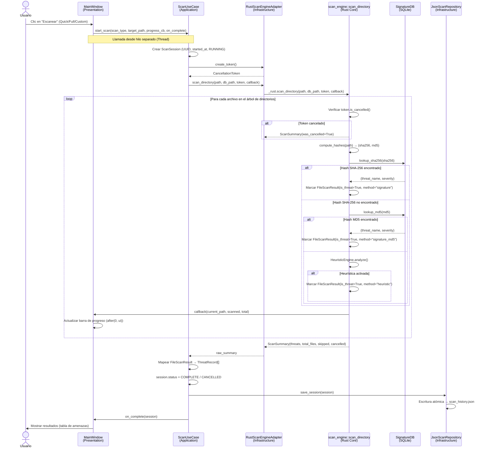
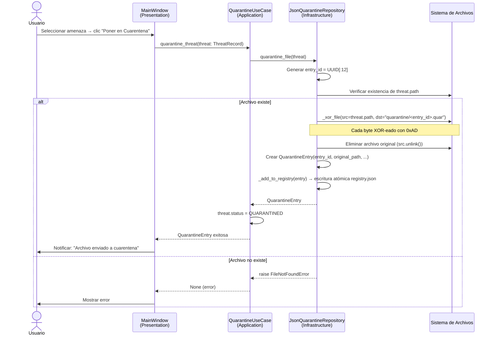
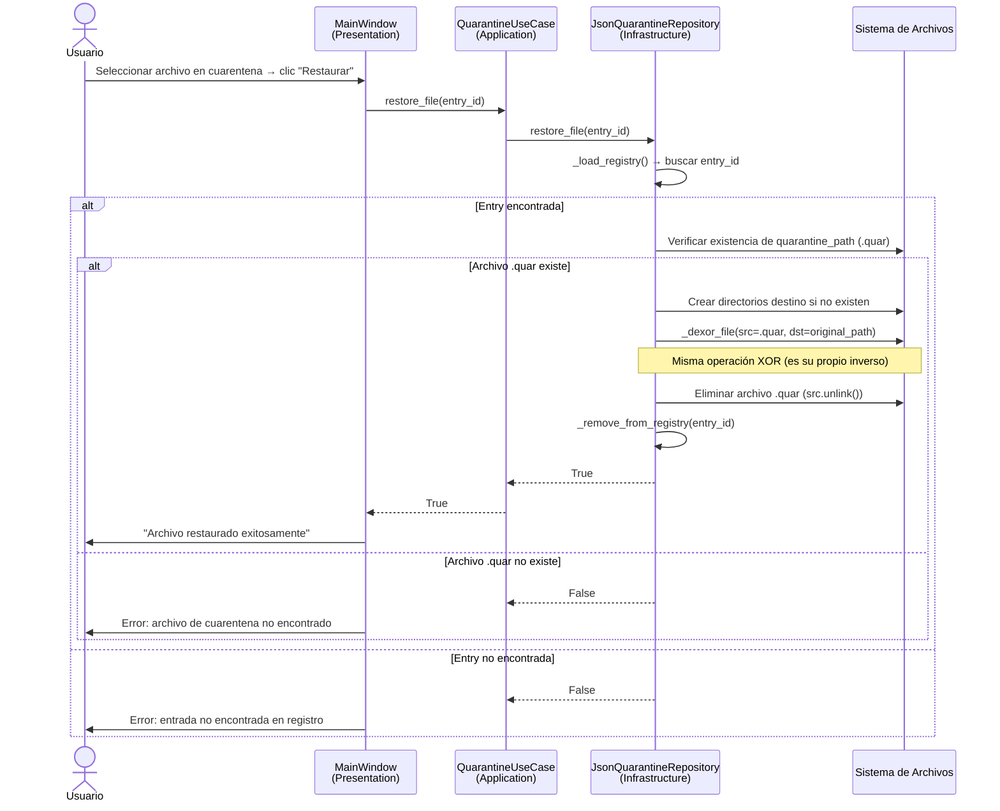
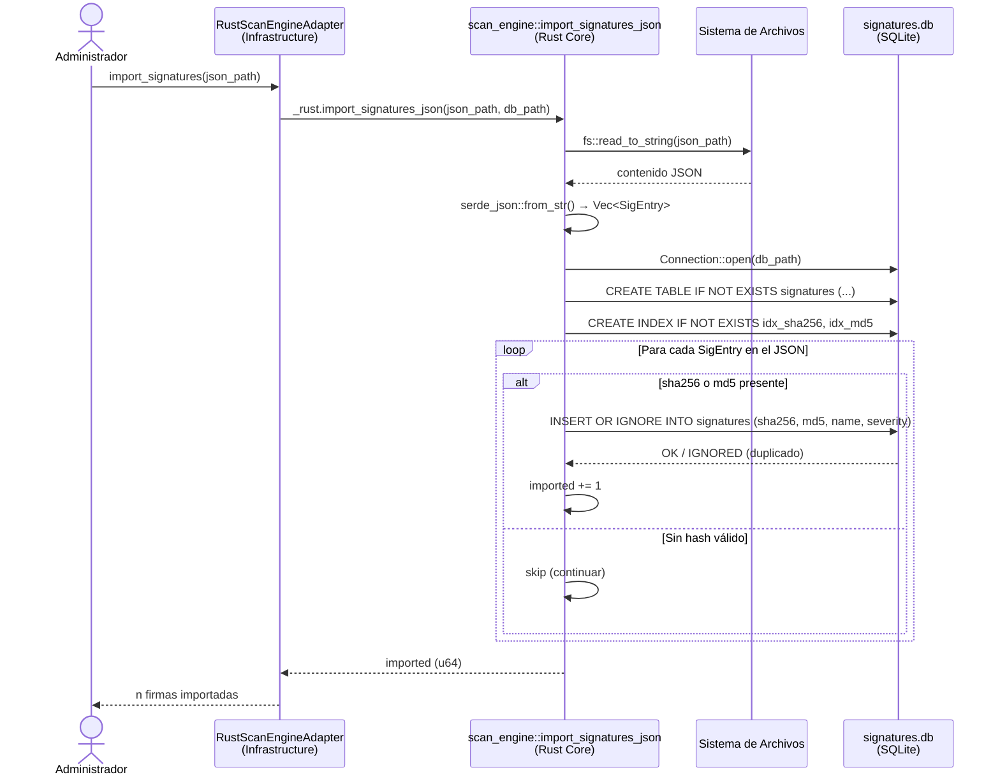

<center>


**UNIVERSIDAD PRIVADA DE TACNA**

**FACULTAD DE INGENIERIA**

**Escuela Profesional de Ingeniería de Sistemas**

**Proyecto RustGuard — Historias de Usuario y Escenarios de Prueba**

Curso: *Calidad y Pruebas de Software*

Docente: *Mag. Patrick Cuadros Quiroga*

Integrantes:

***LLica Mamani, Jimmy Mijair (2023076789)***

***Sierra Ruiz, Iker Alberto (2023077090)***

**Tacna – Perú**

***2026***

</center>

<div style="page-break-after: always; visibility: hidden"></div>

Sistema *RustGuard Antivirus*

Historias de Usuario y Escenarios de Prueba — FD03

Versión *1.0*

| CONTROL DE VERSIONES | | | | | |
|:---:|:---|:---|:---|:---|:---|
| Versión | Hecha por | Revisada por | Aprobada por | Fecha | Motivo |
| 1.0 | LLica Mamani, Jimmy Mijair | Sierra Ruiz, Iker Alberto | LLica Mamani, Jimmy Mijair | 28/03/2026 | Versión Original |

<div style="page-break-after: always; visibility: hidden"></div>

# ÍNDICE GENERAL

- [1. Historias de Usuario](#1-historias-de-usuario)
- [2. Criterios de Aceptación](#2-criterios-de-aceptación)
- [3. Escenarios de Prueba (Gherkin)](#3-escenarios-de-prueba-gherkin)
- [4. Diagramas de Secuencia](#4-diagramas-de-secuencia)

<div style="page-break-after: always; visibility: hidden"></div>

---

## 1. Historias de Usuario

Las siguientes historias de usuario han sido derivadas directamente de las funcionalidades implementadas en el código fuente de RustGuard.

---

### HU-01 — Escaneo Rápido de Rutas de Alto Riesgo

**Identificador**: HU-01  
**Módulo**: Scanner  
**Prioridad**: Alta  
**Estimación**: 3 puntos de historia

> **Como** usuario doméstico que desea verificar rápidamente su equipo,  
> **quiero** ejecutar un escaneo rápido de las rutas de alto riesgo predefinidas (Downloads, Desktop, Temp, AppData/Roaming),  
> **para** detectar amenazas en los directorios más vulnerables sin esperar un escaneo completo.

**Referencia de código**: `gui/shared/constants.py` → `get_quick_scan_paths()`, `gui/application/use_cases/scan_use_case.py` → `ScanUseCase.start_scan()`, `ScanType.QUICK`

---

### HU-02 — Escaneo Completo del Sistema de Archivos

**Identificador**: HU-02  
**Módulo**: Scanner  
**Prioridad**: Alta  
**Estimación**: 5 puntos de historia

> **Como** administrador de sistemas que realiza revisiones periódicas de seguridad,  
> **quiero** ejecutar un escaneo completo del directorio raíz del sistema,  
> **para** detectar cualquier amenaza presente en el disco, independientemente de su ubicación.

**Referencia de código**: `gui/shared/constants.py` → `get_full_scan_path()`, `scan_engine/src/lib.rs` → `scan_directory()`, `ScanType.FULL`

---

### HU-03 — Escaneo de Directorio Personalizado

**Identificador**: HU-03  
**Módulo**: Scanner  
**Prioridad**: Alta  
**Estimación**: 3 puntos de historia

> **Como** investigador de seguridad que analiza muestras de malware,  
> **quiero** escanear un directorio específico seleccionado manualmente,  
> **para** focalizar el análisis en carpetas concretas sin procesar el sistema completo.

**Referencia de código**: `gui/domain/entities/models.py` → `ScanType.CUSTOM`, `gui/application/use_cases/scan_use_case.py` → `start_scan(scan_type=ScanType.CUSTOM, target_path=...)`

---

### HU-04 — Cancelación de Escaneo en Curso

**Identificador**: HU-04  
**Módulo**: Scanner  
**Prioridad**: Alta  
**Estimación**: 2 puntos de historia

> **Como** usuario que ha iniciado un escaneo completo pero necesita usar el equipo urgentemente,  
> **quiero** detener el escaneo en cualquier momento presionando el botón Cancelar,  
> **para** recuperar el control del sistema sin esperar a que el escaneo termine.

**Referencia de código**: `scan_engine/src/lib.rs` → `CancellationToken` (Arc<AtomicBool>), `gui/application/use_cases/scan_use_case.py` → `ScanUseCase.cancel_scan()`, `ScanStatus.CANCELLED`

---

### HU-05 — Detección por Hash Criptográfico (SHA-256 / MD5)

**Identificador**: HU-05  
**Módulo**: Motor de Detección  
**Prioridad**: Crítica  
**Estimación**: 8 puntos de historia

> **Como** sistema antivirus,  
> **quiero** calcular el hash SHA-256 (y MD5 como fallback) de cada archivo escaneado y compararlo contra la base de datos de firmas SQLite,  
> **para** identificar con precisión archivos de malware conocido sin generar falsos positivos.

**Referencia de código**: `scan_engine/src/lib.rs` → `compute_hashes()`, `SignatureDb::lookup_sha256()`, `SignatureDb::lookup_md5()`, `FileScanResult.detection_method = "signature" | "signature_md5"`

---

### HU-06 — Detección Heurística de Amenazas Desconocidas

**Identificador**: HU-06  
**Módulo**: Motor de Detección  
**Prioridad**: Alta  
**Estimación**: 5 puntos de historia

> **Como** sistema antivirus,  
> **quiero** analizar atributos de archivos ejecutables (extensión, ubicación, tamaño) mediante reglas heurísticas,  
> **para** detectar amenazas potenciales que no estén registradas en la base de firmas.

**Referencia de código**: `scan_engine/src/lib.rs` → `HeuristicEngine::analyze()`, reglas: doble extensión, ejecutable oculto, ejecutable grande en temp, ejecutable vacío, ejecutable en AppData

---

### HU-07 — Enviar Archivo a Cuarentena

**Identificador**: HU-07  
**Módulo**: Cuarentena  
**Prioridad**: Alta  
**Estimación**: 5 puntos de historia

> **Como** usuario que ha detectado una amenaza en su sistema,  
> **quiero** enviar el archivo amenazante a una zona de cuarentena segura,  
> **para** neutralizar la amenaza impidiendo su ejecución accidental sin eliminarlo permanentemente.

**Referencia de código**: `gui/infrastructure/repositories/quarantine_repository.py` → `JsonQuarantineRepository.quarantine_file()`, `_xor_file()`, archivos almacenados como `<entry_id>.quar`

---

### HU-08 — Restaurar Archivo desde Cuarentena

**Identificador**: HU-08  
**Módulo**: Cuarentena  
**Prioridad**: Media  
**Estimación**: 3 puntos de historia

> **Como** usuario que ha identificado un falso positivo en cuarentena,  
> **quiero** restaurar el archivo a su ubicación original,  
> **para** recuperar un archivo legítimo que fue incorrectamente clasificado como amenaza.

**Referencia de código**: `gui/infrastructure/repositories/quarantine_repository.py` → `JsonQuarantineRepository.restore_file()`, `_dexor_file()`, lectura del `registry.json`

---

### HU-09 — Eliminar Permanentemente Archivo en Cuarentena

**Identificador**: HU-09  
**Módulo**: Cuarentena  
**Prioridad**: Media  
**Estimación**: 2 puntos de historia

> **Como** usuario que ha confirmado que un archivo es malicioso,  
> **quiero** eliminar permanentemente el archivo de la cuarentena,  
> **para** liberar espacio en disco y eliminar definitivamente la amenaza.

**Referencia de código**: `gui/infrastructure/repositories/quarantine_repository.py` → `JsonQuarantineRepository.delete_quarantined()`, `Path.unlink()`, `_remove_from_registry()`

---

### HU-10 — Consultar Historial de Escaneos

**Identificador**: HU-10  
**Módulo**: Historial  
**Prioridad**: Media  
**Estimación**: 3 puntos de historia

> **Como** administrador de sistemas que lleva un control de la seguridad del equipo,  
> **quiero** visualizar el historial de todos los escaneos realizados ordenados por fecha,  
> **para** revisar el estado de seguridad del equipo a lo largo del tiempo y auditar las actividades de escaneo.

**Referencia de código**: `gui/application/use_cases/scan_use_case.py` → `HistoryUseCase.get_all_sessions()`, `gui/infrastructure/repositories/scan_repository.py` → `JsonScanRepository.load_all_sessions()`

---

### HU-11 — Importar Base de Datos de Firmas

**Identificador**: HU-11  
**Módulo**: Gestión de Firmas  
**Prioridad**: Alta  
**Estimación**: 3 puntos de historia

> **Como** administrador de sistemas que desea mantener actualizada la base de firmas,  
> **quiero** importar un archivo JSON con hashes de malware conocido hacia la base de datos SQLite,  
> **para** ampliar la capacidad de detección del motor con firmas actualizadas de fuentes como MalwareBazaar.

**Referencia de código**: `scan_engine/src/lib.rs` → `import_signatures_json()`, `gui/infrastructure/scanner/rust_engine_adapter.py` → `RustScanEngineAdapter.import_signatures()`

---

### HU-12 — Progreso en Tiempo Real Durante el Escaneo

**Identificador**: HU-12  
**Módulo**: Interfaz de Usuario  
**Prioridad**: Media  
**Estimación**: 3 puntos de historia

> **Como** usuario que ha iniciado un escaneo de directorio,  
> **quiero** ver en la interfaz gráfica el progreso actualizado en tiempo real (ruta actual, archivos procesados, total),  
> **para** conocer el estado del escaneo y estimar el tiempo restante.

**Referencia de código**: `scan_engine/src/lib.rs` → `scan_directory()` con `callback.call1(py, (path_str, scanned, total_files))`, `gui/application/use_cases/scan_use_case.py` → `progress_callback: Callable[[str, int, int], None]`

---

## 2. Criterios de Aceptación

### CA-01 — Escaneo Rápido

| ID | Criterio | Condición de éxito |
|:--:|:---------|:-------------------|
| CA-01-1 | Las rutas de quick scan se determinan según el sistema operativo | En Windows incluye Downloads, Desktop, Temp, AppData/Roaming; en Linux incluye /tmp, Downloads, Desktop |
| CA-01-2 | El escaneo rápido procesa solo las rutas que existen en el sistema | Rutas inexistentes son omitidas silenciosamente |
| CA-01-3 | La sesión es persistida al finalizar | `scan_history.json` contiene la sesión con `scan_type = "quick"` |
| CA-01-4 | El resultado muestra el total de archivos procesados y amenazas encontradas | `ScanSession.total_files > 0` y `threats_count >= 0` |

### CA-02 — Escaneo Completo

| ID | Criterio | Condición de éxito |
|:--:|:---------|:-------------------|
| CA-02-1 | El escaneo recorre recursivamente todos los subdirectorios del path raíz | `WalkDir` sin límite de profundidad |
| CA-02-2 | Archivos no accesibles por permisos son contados como `skipped` sin abortar | `ScanSession.skipped_files >= 0`, escaneo continúa |
| CA-02-3 | La barra de progreso refleja el porcentaje real de archivos procesados | `scanned / total_files * 100` actualizado por callback |

### CA-04 — Cancelación

| ID | Criterio | Condición de éxito |
|:--:|:---------|:-------------------|
| CA-04-1 | El escaneo se detiene dentro del procesamiento del archivo actual | No procesa más archivos tras la cancelación |
| CA-04-2 | El estado de la sesión es `CANCELLED` | `ScanSession.status == ScanStatus.CANCELLED` |
| CA-04-3 | Las amenazas detectadas hasta el momento de cancelación se conservan | `session.threats` contiene los registros previos a la cancelación |

### CA-05 — Detección por Firma

| ID | Criterio | Condición de éxito |
|:--:|:---------|:-------------------|
| CA-05-1 | Archivo con SHA-256 en la DB es detectado con método "signature" | `FileScanResult.detection_method == "signature"` |
| CA-05-2 | Archivo con MD5 (pero no SHA-256) en la DB es detectado con método "signature_md5" | `FileScanResult.detection_method == "signature_md5"` |
| CA-05-3 | Archivo limpio no presente en la DB retorna `is_threat = false` con método "clean" | `FileScanResult.is_threat == false` |
| CA-05-4 | El nombre de la amenaza corresponde al campo `name` en la tabla `signatures` | `FileScanResult.threat_name == signatures.name` |

### CA-06 — Detección Heurística

| ID | Criterio | Condición de éxito |
|:--:|:---------|:-------------------|
| CA-06-1 | Archivo con nombre `documento.pdf.exe` es detectado como heurístico | `detection_method == "heuristic"`, `threat_name` contiene "Double extension" |
| CA-06-2 | Archivo `.hidden.exe` es detectado como heurístico | `threat_name` contiene "Hidden executable" |
| CA-06-3 | Archivo `.exe` de 0 bytes es detectado como heurístico | `threat_name` contiene "Zero-byte executable" |

### CA-07 — Cuarentena

| ID | Criterio | Condición de éxito |
|:--:|:---------|:-------------------|
| CA-07-1 | Archivo en cuarentena existe en el directorio `quarantine/` con extensión `.quar` | `Path("quarantine/<entry_id>.quar").exists() == True` |
| CA-07-2 | Archivo original es eliminado tras cuarentena exitosa | `Path(threat.path).exists() == False` |
| CA-07-3 | El registro `quarantine/registry.json` contiene la entrada de la amenaza | `entry_id` presente en el JSON |
| CA-07-4 | El archivo en cuarentena tiene contenido XOR-ofuscado | Primer byte de `.quar` != primer byte del original |

### CA-08 — Restauración

| ID | Criterio | Condición de éxito |
|:--:|:---------|:-------------------|
| CA-08-1 | El archivo restaurado es idéntico al original | Hash SHA-256 del archivo restaurado == hash original |
| CA-08-2 | El archivo `.quar` es eliminado tras restauración exitosa | `Path(quarantine_path).exists() == False` |
| CA-08-3 | La entrada es removida del `registry.json` | `entry_id` no presente en el JSON tras restauración |

---

## 3. Escenarios de Prueba (Gherkin)

### Escenario 1 — Detección de malware por SHA-256

```gherkin
Feature: Detección por firma criptográfica SHA-256
  Como motor de escaneo
  Quiero comparar el hash SHA-256 de cada archivo con la base de firmas
  Para identificar malware conocido con precisión

  Background:
    Given que la base de datos SQLite contiene la firma:
      | sha256                                                           | name           | severity |
      | 275a021bbfb6489e54d471899f7db9d1663fc695ec2fe2a2c4538aabf651fd0f | EICAR-Test-File | high    |
    And el motor Rust está compilado e importado como módulo Python

  Scenario: Archivo de malware conocido es detectado por SHA-256
    Given que existe un archivo "test_malware.exe" en el directorio temporal
    And su hash SHA-256 es "275a021bbfb6489e54d471899f7db9d1663fc695ec2fe2a2c4538aabf651fd0f"
    When el usuario ejecuta scan_file("test_malware.exe", db_path)
    Then el resultado tiene is_threat = True
    And threat_name = "EICAR-Test-File"
    And detection_method = "signature"
    And error = ""

  Scenario: Archivo limpio no es detectado como amenaza
    Given que existe un archivo "documento.txt" con contenido ordinario
    And su hash SHA-256 no está en la base de firmas
    When el usuario ejecuta scan_file("documento.txt", db_path)
    Then el resultado tiene is_threat = False
    And detection_method = "clean"
    And threat_name = ""
```

---

### Escenario 2 — Detección heurística por extensión doble

```gherkin
Feature: Detección heurística de extensión doble
  Como motor heurístico
  Quiero identificar archivos con extensiones engañosas
  Para proteger al usuario de ataques de ingeniería social

  Scenario: Archivo con doble extensión es marcado como amenaza heurística
    Given que existe un archivo llamado "factura_abril.pdf.exe"
    And el archivo no está en la base de firmas SQLite
    When se aplica HeuristicEngine.analyze() sobre el archivo
    Then is_suspicious = True
    And la razón contiene "Double extension attack"
    And detection_method = "heuristic"

  Scenario: Archivo con extensión simple legítima no activa la heurística de doble extensión
    Given que existe un archivo llamado "programa.exe"
    And el nombre no coincide con el patrón de doble extensión
    When se aplica HeuristicEngine.analyze() sobre el archivo
    Then la regla de doble extensión no se activa
```

---

### Escenario 3 — Cuarentena de archivo detectado

```gherkin
Feature: Sistema de cuarentena de archivos maliciosos
  Como usuario
  Quiero aislar archivos amenazantes en cuarentena
  Para neutralizar la amenaza sin eliminarla permanentemente

  Scenario: Archivo amenazante es enviado exitosamente a cuarentena
    Given que existe un archivo "virus.exe" en "/home/user/downloads/"
    And ThreatRecord contiene path = "/home/user/downloads/virus.exe"
    When se ejecuta QuarantineUseCase.quarantine_threat(threat)
    Then existe un archivo con extensión ".quar" en el directorio quarantine/
    And el archivo original "/home/user/downloads/virus.exe" ya no existe
    And quarantine/registry.json contiene una entrada con original_path = "/home/user/downloads/virus.exe"
    And el contenido del archivo .quar es XOR-ofuscado con clave 0xAD

  Scenario: Intento de cuarentena de archivo inexistente lanza FileNotFoundError
    Given que el archivo indicado en ThreatRecord.path no existe en disco
    When se ejecuta QuarantineUseCase.quarantine_threat(threat)
    Then se lanza FileNotFoundError
    And no se crea ningún archivo .quar en quarantine/
    And registry.json no es modificado

  Scenario: Archivo en cuarentena es restaurado a su ubicación original
    Given que existe una entrada en quarantine/registry.json con entry_id = "abc123"
    And el archivo quarantine/abc123.quar existe y está XOR-ofuscado
    When se ejecuta QuarantineUseCase.restore_file("abc123")
    Then el archivo es restaurado a su ruta original con contenido original
    And quarantine/abc123.quar es eliminado
    And la entrada "abc123" ya no está en registry.json
    And el hash SHA-256 del archivo restaurado es igual al hash original
```

---

### Escenario 4 — Cancelación de escaneo en curso

```gherkin
Feature: Cancelación cooperativa de escaneo
  Como usuario
  Quiero poder detener un escaneo en progreso
  Para recuperar el control del sistema cuando sea necesario

  Scenario: Usuario cancela escaneo a mitad de proceso
    Given que se ha iniciado un escaneo completo del directorio "/home/user"
    And el escaneo ha procesado al menos 10 archivos
    When el usuario hace clic en el botón "Cancelar"
    And CancellationToken.cancel() es invocado
    Then el escaneo se detiene antes de procesar el siguiente archivo
    And ScanSession.status = CANCELLED
    And ScanSession.threats contiene las amenazas detectadas hasta el momento de la cancelación
    And ScanSession es persistida en scan_history.json con status = "CANCELLED"

  Scenario: Escaneo completado normalmente no es marcado como cancelado
    Given que se ha iniciado un escaneo de un directorio con 5 archivos
    And el usuario no presiona Cancelar durante el proceso
    When el escaneo procesa todos los archivos
    Then ScanSession.status = COMPLETE
    And ScanSession.was_cancelled = False
```

---

### Escenario 5 — Importación de firmas desde JSON

```gherkin
Feature: Importación de base de firmas
  Como administrador de sistemas
  Quiero importar hashes de malware desde un archivo JSON
  Para mantener actualizada la capacidad de detección del motor

  Scenario: Importación exitosa de firmas válidas
    Given que existe un archivo "signatures.json" con contenido:
      | sha256                                                           | md5                              | name           | severity |
      | 275a021bbfb6489e54d471899f7db9d1663fc695ec2fe2a2c4538aabf651fd0f | 44d88612fea8a8f36de82e1278abb02f | EICAR-Test-File | high    |
    When se ejecuta import_signatures_json("signatures.json", "signatures/signatures.db")
    Then la función retorna 1 (número de firmas importadas)
    And la tabla signatures de la base de datos contiene la nueva entrada
    And los índices idx_sha256 e idx_md5 existen en la base de datos

  Scenario: Firmas duplicadas no son re-importadas
    Given que "EICAR-Test-File" ya existe en la base de datos
    When se ejecuta import_signatures_json con el mismo archivo
    Then la función retorna 0 (cero nuevas importaciones)
    And la base de datos no contiene duplicados
```

---

### Escenario 6 — Historial de escaneos persistente

```gherkin
Feature: Historial persistente de sesiones de escaneo
  Como usuario
  Quiero consultar el historial de escaneos anteriores
  Para auditar la actividad de seguridad del equipo

  Scenario: Sesión de escaneo completada es guardada en historial
    Given que se ha completado un escaneo de tipo "quick"
    And se detectaron 2 amenazas en 1500 archivos
    When se consulta HistoryUseCase.get_all_sessions()
    Then la sesión más reciente aparece primera en la lista
    And session.scan_type = ScanType.QUICK
    And session.total_files = 1500
    And session.threats_count = 2
    And session.status = ScanStatus.COMPLETE

  Scenario: Historial es ordenado de más reciente a más antiguo
    Given que existen 3 sesiones en scan_history.json con fechas distintas
    When se consulta HistoryUseCase.get_all_sessions()
    Then la lista está ordenada por started_at en orden descendente
```

---

## 4. Diagramas de Secuencia

### 4.1. Flujo de Escaneo de Directorio



---

### 4.2. Flujo de Cuarentena



---

### 4.3. Flujo de Restauración desde Cuarentena



---

### 4.4. Flujo de Importación de Firmas


