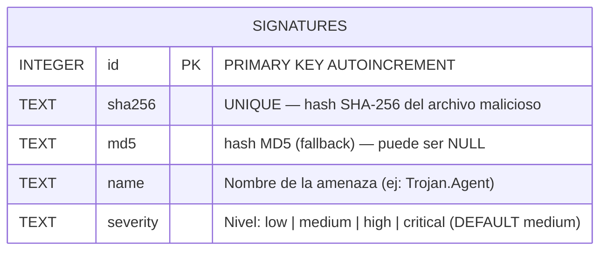
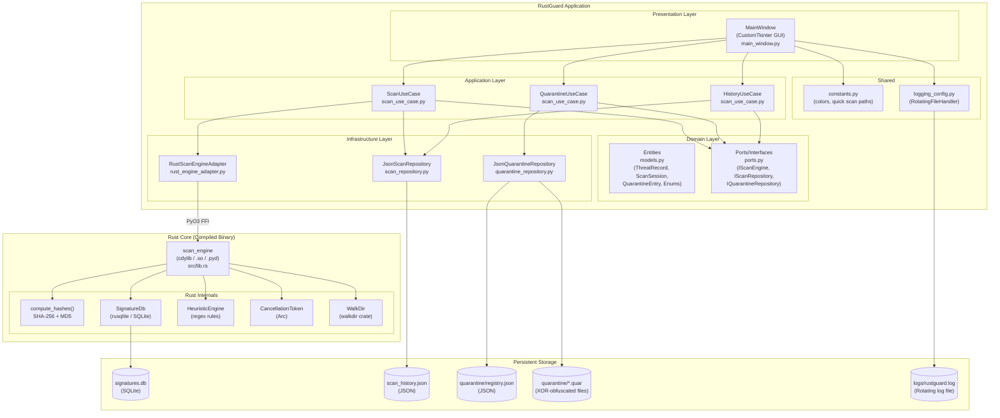
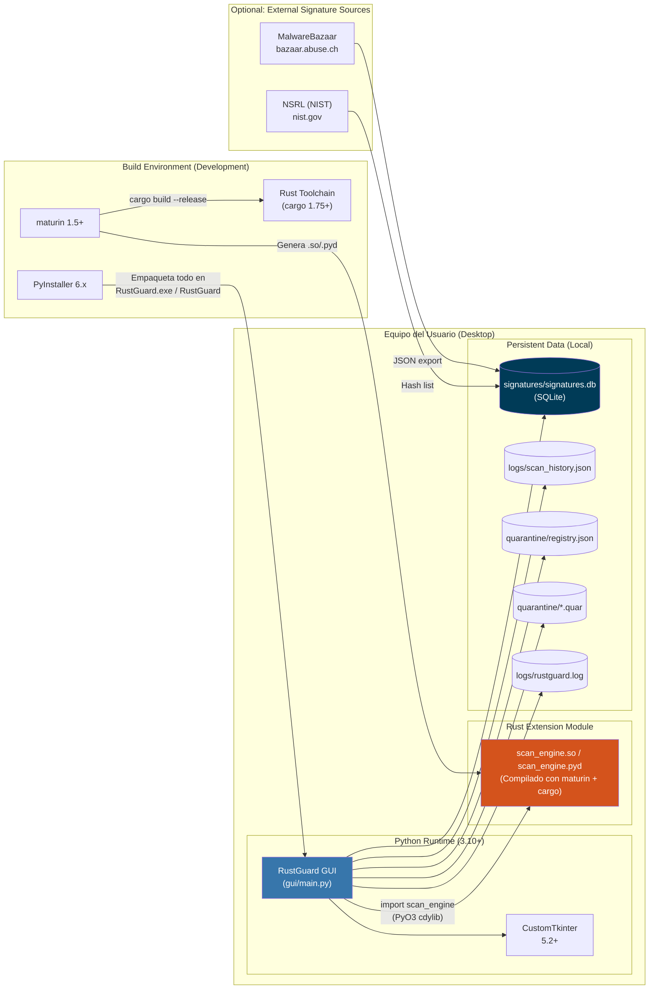
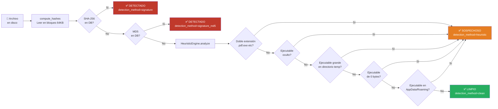
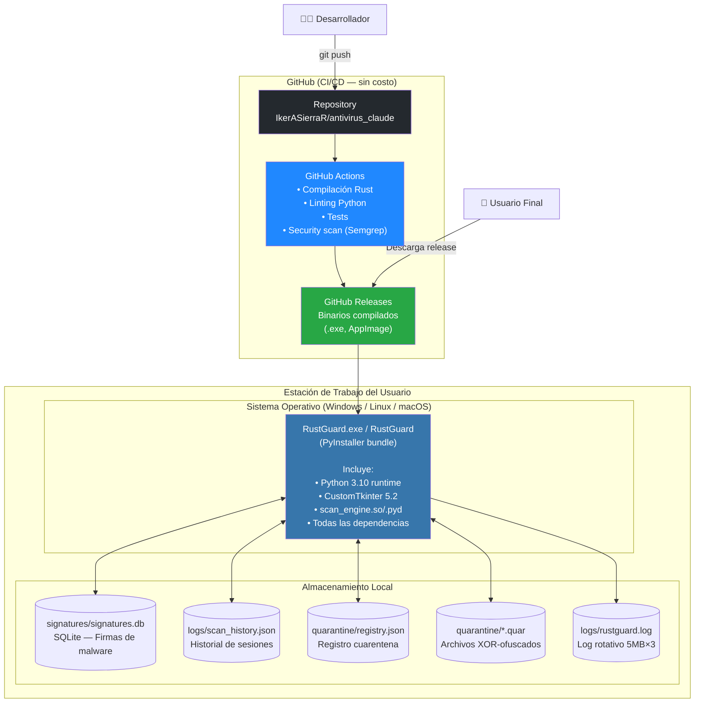
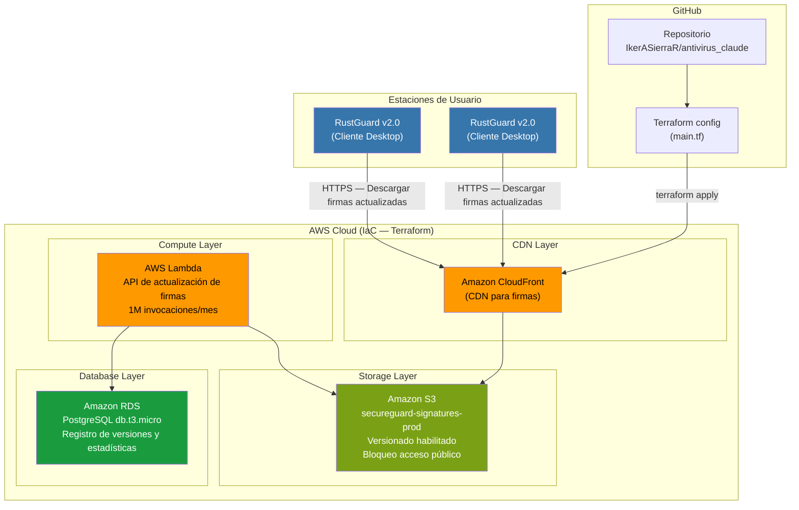

<center>


**UNIVERSIDAD PRIVADA DE TACNA**

**FACULTAD DE INGENIERIA**

**Escuela Profesional de Ingeniería de Sistemas**

**Proyecto RustGuard — Diagramas de Ingeniería Inversa**

Curso: *Calidad y Pruebas de Software*

Docente: *Mag. Patrick Cuadros Quiroga*

Integrantes:

***LLica Mamani, Jimmy Mijair (2023076789)***

***Sierra Ruiz, Iker Alberto (2023077090)***

**Tacna – Perú**

***2026***

</center>

<div style="page-break-after: always; visibility: hidden"></div>

Sistema *RustGuard Antivirus*

Diagramas de Arquitectura (Ingeniería Inversa) — FD04

Versión *1.0*

| CONTROL DE VERSIONES | | | | | |
|:---:|:---|:---|:---|:---|:---|
| Versión | Hecha por | Revisada por | Aprobada por | Fecha | Motivo |
| 1.0 | LLica Mamani, Jimmy Mijair | Sierra Ruiz, Iker Alberto | LLica Mamani, Jimmy Mijair | 28/03/2026 | Versión Original |

<div style="page-break-after: always; visibility: hidden"></div>

# ÍNDICE GENERAL

- [1. Diagrama de Clases](#1-diagrama-de-clases)
- [2. Diagrama de Base de Datos](#2-diagrama-de-base-de-datos)
- [3. Diagrama de Componentes](#3-diagrama-de-componentes)
- [4. Diagrama de Despliegue](#4-diagrama-de-despliegue)
- [5. Diagrama de Arquitectura](#5-diagrama-de-arquitectura)
- [6. Diagrama de Infraestructura](#6-diagrama-de-infraestructura)

<div style="page-break-after: always; visibility: hidden"></div>

> **Nota metodológica**: Todos los diagramas de este documento han sido generados mediante **ingeniería inversa** del código fuente del repositorio. Los elementos representados corresponden exclusivamente a clases, módulos, entidades y relaciones presentes en el código real.

---

## 1. Diagrama de Clases

El siguiente diagrama representa las clases Python del módulo `gui/` y las estructuras Rust del módulo `scan_engine/`, inferidas directamente del código fuente.

```mermaid
classDiagram
    %% ── ENUMERACIONES ──────────────────────────────────────────────
    class ScanType {
        <<enumeration>>
        QUICK = "quick"
        FULL = "full"
        CUSTOM = "custom"
        SINGLE = "single"
    }

    class ThreatStatus {
        <<enumeration>>
        DETECTED = "detected"
        QUARANTINED = "quarantined"
        DELETED = "deleted"
        IGNORED = "ignored"
    }

    class DetectionMethod {
        <<enumeration>>
        SIGNATURE = "signature"
        SIGNATURE_MD5 = "signature_md5"
        HEURISTIC = "heuristic"
        CLEAN = "clean"
        ERROR = "error"
        INFO_ONLY = "info_only"
    }

    class ScanStatus {
        <<enumeration>>
        IDLE
        RUNNING
        CANCELLED
        COMPLETE
        ERROR
    }

    %% ── ENTIDADES DE DOMINIO ────────────────────────────────────────
    class ThreatRecord {
        +str path
        +str sha256
        +str md5
        +str threat_name
        +DetectionMethod detection_method
        +int file_size
        +datetime detected_at
        +ThreatStatus status
        +str original_path
        +str quarantine_path
        +filename() str
        +size_human() str
    }

    class ScanSession {
        +str session_id
        +ScanType scan_type
        +str target_path
        +datetime started_at
        +datetime finished_at
        +int total_files
        +int threats_count
        +int skipped_files
        +ScanStatus status
        +list~ThreatRecord~ threats
        +was_cancelled() bool
        +duration_seconds() float
        +duration_human() str
    }

    class QuarantineEntry {
        +str entry_id
        +str original_path
        +str quarantine_path
        +str threat_name
        +str sha256
        +datetime quarantined_at
        +int file_size
        +filename() str
    }

    %% ── INTERFACES (PUERTOS) ────────────────────────────────────────
    class IScanEngine {
        <<interface>>
        +scan_directory(path, callback, token) ScanSummary
        +scan_single_file(path) FileScanResult
        +import_signatures(json_path) int
        +create_token() CancellationToken
    }

    class IScanRepository {
        <<interface>>
        +save_session(session) None
        +load_all_sessions() list~ScanSession~
        +delete_session(session_id) None
    }

    class IQuarantineRepository {
        <<interface>>
        +quarantine_file(threat) QuarantineEntry
        +restore_file(entry_id) bool
        +delete_quarantined(entry_id) bool
        +list_quarantined() list~QuarantineEntry~
    }

    %% ── CASOS DE USO ────────────────────────────────────────────────
    class ScanUseCase {
        -IScanEngine _engine
        -IScanRepository _scan_repo
        -CancellationToken _active_token
        +start_scan(type, path, progress_cb, on_complete) None
        +scan_single_file(path) ScanSession
        +cancel_scan() None
        -_map_to_threat(raw) ThreatRecord
    }

    class QuarantineUseCase {
        -IQuarantineRepository _repo
        +quarantine_threat(threat) QuarantineEntry
        +restore_file(entry_id) bool
        +delete_quarantined(entry_id) bool
        +list_quarantined() list~QuarantineEntry~
    }

    class HistoryUseCase {
        -IScanRepository _repo
        +get_all_sessions() list~ScanSession~
        +clear_history() None
    }

    %% ── INFRAESTRUCTURA ─────────────────────────────────────────────
    class RustScanEngineAdapter {
        -str _db_path
        +scan_directory(path, callback, token)
        +scan_single_file(path)
        +import_signatures(json_path) int
        +create_token()
    }

    class JsonScanRepository {
        -Path _path
        +save_session(session) None
        +load_all_sessions() list~ScanSession~
        +delete_session(session_id) None
        -_load_raw() list~dict~
        -_atomic_write(data) None
        -_serialize(session) dict
        -_deserialize(d) ScanSession
    }

    class JsonQuarantineRepository {
        -Path _qdir
        -Path _registry_path
        +quarantine_file(threat) QuarantineEntry
        +restore_file(entry_id) bool
        +delete_quarantined(entry_id) bool
        +list_quarantined() list~QuarantineEntry~
        -_xor_file(src, dst) None
        -_dexor_file(src, dst) None
        -_load_registry() list~QuarantineEntry~
        -_write_registry(entries) None
    }

    %% ── RUST STRUCTS (via PyO3) ─────────────────────────────────────
    class FileScanResult {
        <<Rust/PyO3>>
        +str path
        +str sha256
        +str md5
        +bool is_threat
        +str threat_name
        +str detection_method
        +u64 file_size
        +str error
    }

    class ScanSummary {
        <<Rust/PyO3>>
        +u64 total_files
        +u64 threats_found
        +u64 skipped_files
        +bool was_cancelled
        +Vec~FileScanResult~ threats
    }

    class CancellationToken {
        <<Rust/PyO3>>
        -Arc~AtomicBool~ flag
        +cancel() None
        +reset() None
        +is_cancelled() bool
    }

    %% ── RELACIONES ──────────────────────────────────────────────────
    ScanSession "1" *-- "0..*" ThreatRecord : contains
    ThreatRecord --> ThreatStatus
    ThreatRecord --> DetectionMethod
    ScanSession --> ScanType
    ScanSession --> ScanStatus

    ScanUseCase --> IScanEngine : uses
    ScanUseCase --> IScanRepository : uses
    QuarantineUseCase --> IQuarantineRepository : uses
    HistoryUseCase --> IScanRepository : uses

    RustScanEngineAdapter ..|> IScanEngine : implements
    JsonScanRepository ..|> IScanRepository : implements
    JsonQuarantineRepository ..|> IQuarantineRepository : implements

    RustScanEngineAdapter --> FileScanResult : returns
    RustScanEngineAdapter --> ScanSummary : returns
    RustScanEngineAdapter --> CancellationToken : creates
```



---

## 2. Diagrama de Base de Datos

RustGuard utiliza dos mecanismos de persistencia: **SQLite** para la base de firmas de malware y **archivos JSON** para historial de escaneos y registro de cuarentena.

### 2.1. Esquema SQLite — Base de Firmas



**Índices definidos en el código** (`scan_engine/src/lib.rs`):
- `idx_sha256` ON `signatures(sha256)` — Búsqueda O(log n) por SHA-256
- `idx_md5` ON `signatures(md5)` — Búsqueda O(log n) por MD5

**Archivo en disco**: `signatures/signatures.db`

---

### 2.2. Esquema JSON — Historial de Sesiones

**Archivo**: `logs/scan_history.json`

```json
[
  {
    "session_id": "a1b2c3d4",
    "scan_type": "quick | full | custom | single",
    "target_path": "/ruta/escaneada",
    "started_at": "2026-03-28T10:00:00.000000",
    "finished_at": "2026-03-28T10:02:30.000000",
    "total_files": 1500,
    "threats_count": 2,
    "skipped_files": 3,
    "status": "COMPLETE | CANCELLED | ERROR",
    "threats": [
      {
        "path": "/ruta/archivo.exe",
        "sha256": "abc123...",
        "md5": "def456...",
        "threat_name": "EICAR-Test-File",
        "detection_method": "signature | signature_md5 | heuristic",
        "file_size": 68,
        "detected_at": "2026-03-28T10:01:15.000000",
        "status": "detected | quarantined | deleted | ignored",
        "original_path": "",
        "quarantine_path": ""
      }
    ]
  }
]
```

---

### 2.3. Esquema JSON — Registro de Cuarentena

**Archivo**: `quarantine/registry.json`

```json
[
  {
    "entry_id": "abc123def456",
    "original_path": "/home/user/downloads/virus.exe",
    "quarantine_path": "/app/quarantine/abc123def456.quar",
    "threat_name": "EICAR-Test-File",
    "sha256": "275a021b...",
    "quarantined_at": "2026-03-28T10:01:20.000000",
    "file_size": 68
  }
]
```

---

## 3. Diagrama de Componentes



---

## 4. Diagrama de Despliegue



---

## 5. Diagrama de Arquitectura

### 5.1. Arquitectura Limpia (Clean Architecture)

```mermaid
graph TD
    subgraph "🖥️ Presentation Layer\n(gui/presentation/)"
        UI["MainWindow\nmain_window.py\n• Eventos de usuario\n• Barra de progreso\n• Tabla de amenazas\n• CustomTkinter"]
    end

    subgraph "⚙️ Application Layer\n(gui/application/use_cases/)"
        SUC["ScanUseCase\n• Orquesta el ciclo de escaneo\n• Crea ScanSession\n• Mapea resultados Rust → Python"]
        QUC["QuarantineUseCase\n• Gestiona cuarentena/restaurar/eliminar"]
        HUC["HistoryUseCase\n• Carga y ordena sesiones"]
    end

    subgraph "📐 Domain Layer\n(gui/domain/)"
        ENT["Entities\nThreatRecord, ScanSession\nQuarantineEntry\n(Dataclasses puros)"]
        PRT["Interfaces / Ports\nIScanEngine\nIScanRepository\nIQuarantineRepository\n(ABCs)"]
    end

    subgraph "🔧 Infrastructure Layer\n(gui/infrastructure/)"
        ADAPTER["RustScanEngineAdapter\n• Implementa IScanEngine\n• Wraps PyO3 Rust module\n• Fallback Python stub"]
        SCANREPO["JsonScanRepository\n• Implementa IScanRepository\n• Historial en scan_history.json\n• Escritura atómica"]
        QREPO["JsonQuarantineRepository\n• Implementa IQuarantineRepository\n• XOR obfuscation\n• registry.json"]
    end

    subgraph "🦀 Rust Core\n(scan_engine/src/lib.rs)"
        RUST["scan_engine (cdylib)\n• scan_file()\n• scan_directory()\n• import_signatures_json()\n• CancellationToken\n• HeuristicEngine\n• SignatureDb (SQLite)"]
    end

    UI -->|"Llama use cases\ndesde hilo separado"| SUC
    UI --> QUC
    UI --> HUC

    SUC -->|"Usa interfaces"| PRT
    QUC --> PRT
    HUC --> PRT

    ADAPTER ..|"Implementa"| PRT
    SCANREPO ..|"Implementa"| PRT
    QREPO ..|"Implementa"| PRT

    ADAPTER -->|"PyO3 FFI\n(import scan_engine)"| RUST

    SUC --> ENT
    QUC --> ENT
    HUC --> ENT

    style UI fill:#2d5a8e,color:#fff
    style SUC fill:#5a8e2d,color:#fff
    style QUC fill:#5a8e2d,color:#fff
    style HUC fill:#5a8e2d,color:#fff
    style ENT fill:#8e6d2d,color:#fff
    style PRT fill:#8e6d2d,color:#fff
    style ADAPTER fill:#8e2d2d,color:#fff
    style SCANREPO fill:#8e2d2d,color:#fff
    style QREPO fill:#8e2d2d,color:#fff
    style RUST fill:#d4531c,color:#fff
```

---

### 5.2. Flujo de Datos — Pipeline de Detección



---

## 6. Diagrama de Infraestructura

### 6.1. Infraestructura Actual (v1.0 — Local)



---

### 6.2. Infraestructura Propuesta (v2.0 — Terraform / AWS)

La siguiente infraestructura es referencial para la versión futura v2.0, alineada con el código Terraform presente en el informe FD01.



### 6.3. Tabla de Recursos Terraform

| Recurso Terraform | Tipo AWS | Función | Costo Estimado |
|:------------------|:---------|:--------|:--------------:|
| `aws_s3_bucket.signatures` | S3 Bucket | Almacenar base de firmas y actualizaciones | $1.50/mes |
| `aws_s3_bucket_versioning` | S3 Versioning | Rollback de versiones de firmas | incluido |
| `aws_s3_bucket_public_access_block` | S3 Policy | Seguridad: bloqueo acceso público | incluido |
| `aws_cloudfront_distribution.signatures_cdn` | CloudFront | CDN global para distribución rápida | $9.00/mes |
| `aws_lambda_function` | Lambda | API de actualización (serverless) | $0.20/mes |
| `aws_db_instance.signatures_db` | RDS PostgreSQL t3.micro | Registro de versiones y estadísticas | $15.00/mes |
| **Total estimado** | | | **~$25.70/mes** |

**Archivo de configuración**: `informes/FD01-Informe-Factibilidad.md` → Sección 4.2.7
